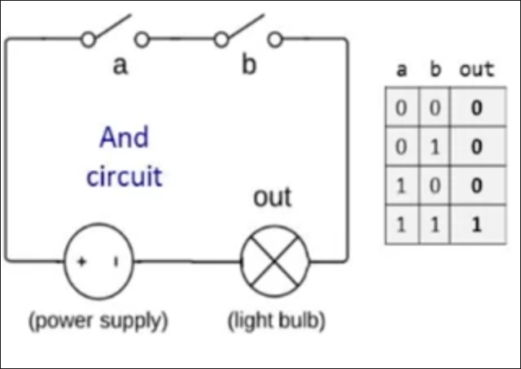

> [!quote] > _Such simple things, And we make of them something so complex it defeats us, Almost._
> -- Josh Ashbery

# 1's and 0's

It's simplest to maintain 0's and 1's as values that we can make computer interpret.
We can infer to them as T's and F's or Y's and N's or 1's and 0's.

### What we can do?

The and operation can work on these 1's and 0's like this in the truth table

Similarly, the or operation as well


We can also build an unary operator that reverses the values


These operations that work like summation and subtraction in arithmetic algebra. We can build formulas similarly

- `Not(0 OR (1 AND 1)) = Not(0 OR 1) = Not(1) = 0`
- `1 AND (0 OR (NOT 1)) = 1 AND (0 OR 0) = 1 AND 0 = 0`

We can also construct general values that operate on boolean algebra and call it _boolean functions_
Examples

- `f(x,y,z) = (x AND y) OR (NOT(x) AND z)`

We can list all the possible outputs of the function, since we have already a finite set of possible inputs for each input , making up to $2^n$ inputs where $n$ is the number of the inputs. This is indifferent to the arithmetic functions. For the above function, the truth table is


This table alone gives a specific description that is stand-alone and can describe a function, just as a formula expression would.

### Boolean Identities

All these identities can be proven right by using a truth table and checking equivalence.

#### Commutative Laws

- `(x AND y) = (y AND X)`
- `(x OR y) = (y OR X)`

#### Associative Laws

- `(x AND (y AND z)) = ((x AND y) AND Z)`
- `(x OR (y OR z)) = ((x OR y) OR Z)`

#### Distributive Laws

- `(x AND (y OR z)) = (x AND y) OR (x AND z)`
- `(x OR (y AND z)) = (x OR y) AND (x OR z)`

#### De Morgan Laws

- `NOT (x AND y) = NOT(x) OR NOT(y)`
- `NOT (x OR y) = NOT(x) AND NOT(y)`

#### Examples

- `NOT(NOT(x) AND (x OR y)) = NOT(NOT(x) AND (NOT(x) AND (NOT (y)) = NOT(NOT(X) AND NOT(Y)) = NOT(NOT(x)) OR NOT(NOT(y)) = x OR y`
  > [!info]
  > We can get the same conclusion by using a truth table and then get the function right from the table, which is usually easier, especially for 2-input functions.

# Boolean Function Synthesis

How we can build a function expression right from the truth table? This is the synthesis of the boolean function. This is what we do when we build a computer. We need to compose boolean functions.

A standard way is to go to the rows that have a value of 1, creating an expression of AND's and OR all these values for all rows with output of 1. This expression is an expression that gets a value of 1 only on that row and 0 elsewhere. It's called a Minterm


We can then use boolean algebra to shorten the boolean function formula expression by boolean identities.


> [!abstract] > **Theorem**
> Any Boolean function can be represented using an expression containing AND, OR and NOT operations.

This doesn't happen in arithmetic functions. We can also use De Morgan laws to construct the OR gate. Here is a more remarkable theorem

> [!abstract] > **Theorem**
> Any Boolean function can be represented using an expression containing AND and NOT operations.

## The NAND function


This gate is composed of NOT and AND functions. What makes this gate remarkable (or the NOR functions as well) is that we can construct all gates right from it, making it possible to represent any expression using NAND gates only

> [!abstract] > **Theorem**
> Any Boolean function can be represented using an expression containing NAND operations only.

**PROOF**: We can prove that we can make AND and NOT using this gate, and therefore prove this theorem

1. `NOT(x) = (x NAND x)`
2. `AND(x) = NOT(x NAND y)`

QED

# Logic Gates

> [!info] >**Gate Logic**
> A technique for implementing Boolean functions using logic gates.

A logic gate is a standalone chip that is designed a well-defined functionality. It can be either Elementary ones (e.g. Nand, And, Or, Not), or composite ones (Mux, Adder, ..)

Every gate has a _gate diagram_. Here is Nand's


## Elementary Logic Gates


## Composite Gates

An extension of the 2-input AND.


**Gate Interface**: What the user thinks what the gate is supposed to do, answering the question why. This has analogy with the principle Encapsulation.

**Gate Implementation**: It answers how this gate does what it's supposed to do. The user doesn't have to know which design (There may be multiple designs) was chosen.

## Circuit Implementation

We can use another language to represent the gates, using electric circuits, wires, and light bulbs to indicate 1's and 0's.




We can do a three-way AND.


> [!error]
> This course doesn't deal with physical implementations. All of the inner implementation is electrical engineering, not computer science.

# Hardware Description Language

This is a language used to simulate logic gates and test them.

## From Requirements to interface.

We need a description of the gate, a diagram and a truth table would suffice

Here is a HDL sub file that has the gate interface with implementation missing.

```hdl
CHIP Xor {
	IN a, b;
	OUT out;
	PARTS:
	// Implementation missing
}
```

We will assume, temporarily, that we have build And, or and Not. We can derive the function

- `a xor b = a and not(b) or b and not(a)`

We can develop this diagram.


## From Gate diagram to HDL

This inner implementation isn't ought to be known by the user and only of importance to the chip builder. This is indicated by the drawing a dashed line around the implementation part.


Notes:

1. It's OK to take any signal and distribute it over many destinations. _Dispatching is OK_.
2. We are using some off-the-shelf gates (supposing we have only NANDs), so we need this gate's signature/API. We have to use the official names of each chip
3. We will need to call each intermediary wire/connection a descriptive name. These names contain no spaces.

We can start writing HDL now. We write a chip at a part

```hdl
CHIP Xor{
	IN a, b;
	OUT out;

PARTS:
	Not (in=a, out=nota);
	Not (in=b, out=notb);
	And (a=a, b=nota, out=aAndNotb);
	And (a=nota, b=b, out=notaAndb);
	Or (a=aAndNotb, b=notaAndb, out=out);
}
```

## Some Comments on HDL

- We have to worry about good documentation, like other PLs.
- HDL is a functional / declarative language. You don't code the procedure, but the description.
- Each time we use a chip, we have to know its interface, that is, know the signature/API of it. As a convention, we use a `a`, `b` for 2-way input gates and `out` as an output for 1-way output gates.

# Hardware Simulation

We will verify that a hardware chip suffices what it's ought to do.

We can use some various options

1. Interactive
2. Script-Based

```hdl
output-list a b out;
set a 0,
set b 0,
eval,
output;
set a 0,
set b 1,
eval,
output;
set a 1,
set b 0,
eval,
output;
set a 1,
set b 1,
eval,
output;
```

3. With/without output and compare files.

## Hardware Construction projects

This approach is like Divide & Conquer

- The Players
  1.  System Architects
      - decides which chips are needed.
      - for each chip, they decide
        - A chip API
        - a test script
        - a compare file
  2.  Developers
      - Build the chips

# Multi-bit Buses

Sometimes we want to manipulate an array of bits. We can think of them as one entity called _Bus_. HDLs will provide will provide some convenient notation for handling these buses.

An example of a bus is a bunch of bits that together are a number. In this example below, we can think of them as two numbers instead of a 32-bit input chip


In HDL, It can be done in this way


We can also get access to each bit using indices, just like in any normal PL.


## sub-buses

We can break them into sub-buses


The notation for breaking these sub-buses differ from every HDL. Look in the documentation.

# Project 1

[Look at project directory]

# References

- Build a Modern Computer from First Principles - Part 1


