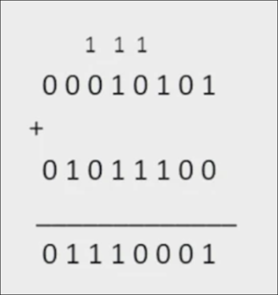
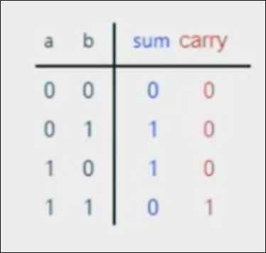
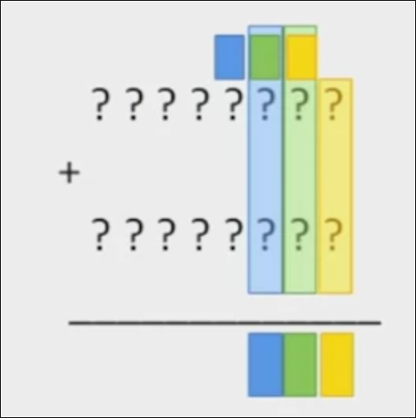
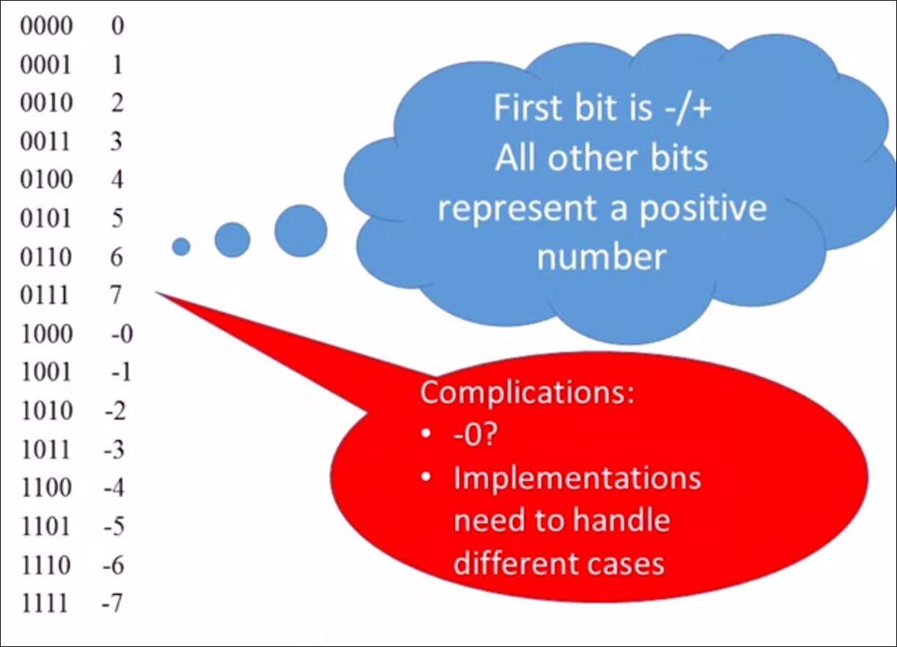
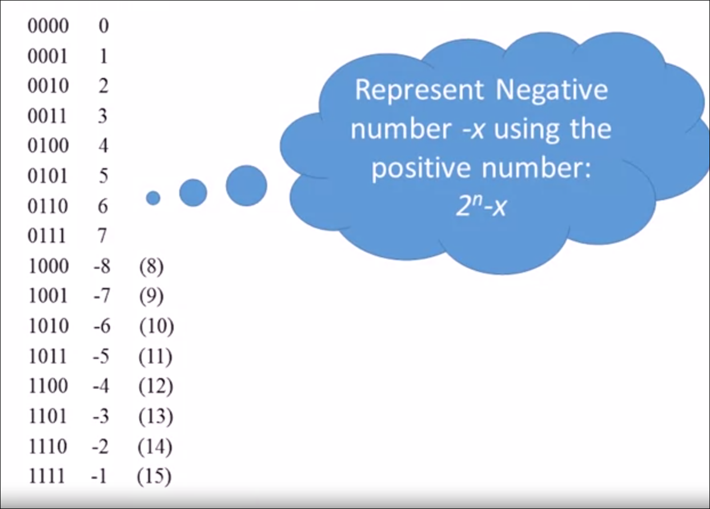
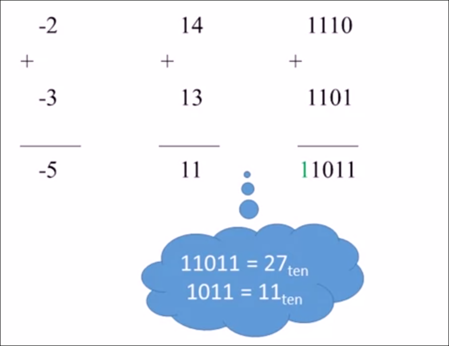
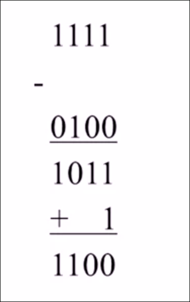
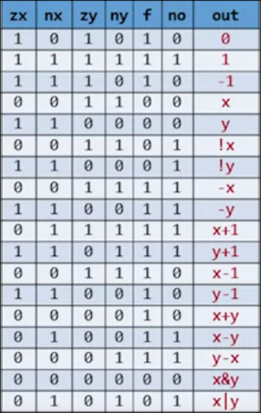
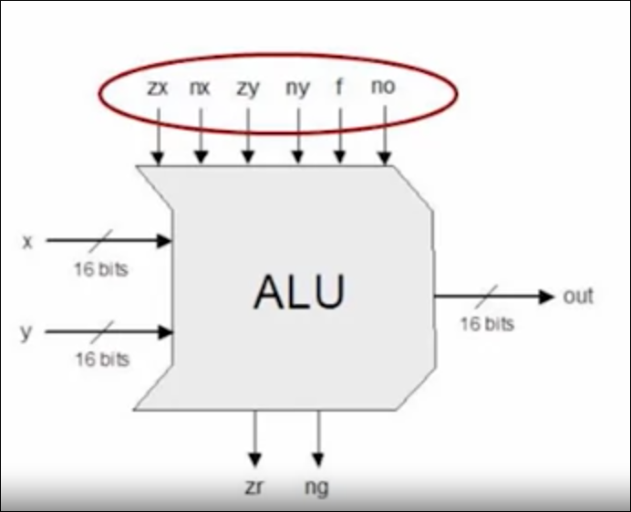
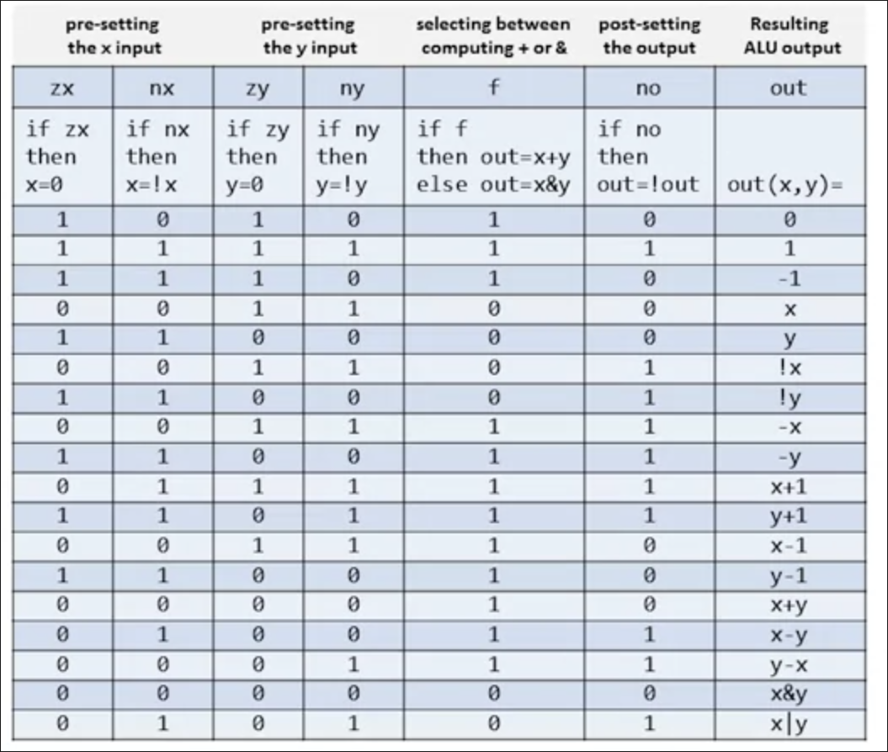

# Binary Numbers

We can represent any decimal number using a sequence of bits. We give each binary bit a weight that starts from $2^0$ and the exponent keeps increasing by one, so each bit has a different power of 2.

$$
(101)_2 = 2 ^ 2 \times 1 + 0 \times 2 ^ 1 + 1 \times 2 ^ 0 = 5
$$

With k bits, we have a maximum decimal number of

$$
\sum_{i}^{k-1} b_{i} 2^i
$$

We have a _fixed number of bits_ in a computer and therefore a fixed word size.

We reserve some part of these possibilities for the negative numbers, making the most left bit an indication of the sign, (and more, called the 2's complement)

When converting from Decimal to binary, we can get the next greatest power of 2 less than the binary number.

$$
87 = 64 + 16 + 4 + 2 + 1 = 01010111
$$

# Binary Addition

We start with the left most digit, and sum up the values, if the sum has more than one bit, we place the first bit in the output and have the other one as a carry.

In this example, an _overflow_ occurred, since there is a final carry that we have to bit to place in.

We either ignore it or have a boolean value that indicates that the answer isn't correct. In short, we can consider calculations in the binary form modulo the fixed word size. We disposed the value of the fixed word size and have only the truncated value

## Building an Adder

### Half Adder

It adds two bits. It is abstracted in this chip with no carry to this operation.

### Full Adder

It adds three bits, or say two bits with a carry of either one or zero. This abstracts this case and uses the already built half adder

### Multi-bit Adder

We just need to repeat every operation of the full adder, directing every operation carry to the next full adder.

_Every step is a full adder_

In this adder, we will ignore the adder

# Negative Numbers

## Representing Number in 4 Bits

We will give up the rightmost bit to represent the sign, but not completely. It's also part of the calculation to get rid of stuff like negative zero

And well, we cannot tell the computer to run an if-statement to check for the rightmost bit easily. Instead we represent the negative number `-x` using the positive number $2^n-x$

## Subtraction

We can convert the negative numbers in two complement form and just do simple addition instead.

We got the same result, even with an overflow.

## Negation / Converting to 2's complement

This is will solve subtraction because $y - x = y + (-x)$

**IDEA**: $2^n -x = 1 + (2^n - 1) - x$. the term $2^n - 1$ is a $n$ sequence of 1's. When subtracting a number from it, we just flip that other number. Now we just and subtract the value of $x$, and add 1.

To add 1, a trick is to flip the bits from right to left, stopping the first time 0 is flipped to 1.

# Arithmetic Logic Unit (ALU)

It computes a function on the input and outputs the result. These functions are multiplication, division, AND, OR, XOR

This is hardware / software tradeoff. because if we won't do it in hardware, we will have to augment it later using software.

## The Hack ALU

Operating on two 16-bit two's complement values and outputs a 16-bit two's complement value. Computes one out of a family of 18 function that are determined using a 6-bit binary

### How it works

We also have output control bits that say something about the output. that is, if the output is zero, we set `zr` is zero. if the output is negative, we set `ng` to 1

> [!quote] > **Simplicity is The Ultimate Sophistication** -- _Leonardo Da Vinci_

# References

- Build a Modern Computer from First Principles - Part 1|Nand2Tetris

