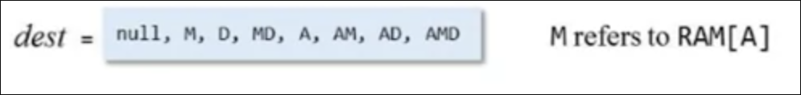

# Overview
Computers are Flexible, can do various tasks.

## Universality
Same hardware can run many different software programs. The *Theory* was done by Alan Turing in his  Universal Turing Machine. and the *practice* was implemented by Jon von Neumann in von Neumann Architecture.


In this computer, in the memory, there are programs instructions that tell it what to do. As the software change, the hardware will do different things.


In the machine language:
1. Operations:  A program has a sequence of instruction. CPU will go an instruction after another to run. We need some basic operations that the computer can do
2. Program Counter: We need a Program Counter to run instructions one after another. We may change order to run loops or to skip part in if statements
3. Addressing: We need address to access data in memory.

We need to compile a nice high-level language to a program in machine language to be run into CPU. 

## Mnemonics
We assign a keyword to a sequence of bits, so we can understand the instructions


- **Interpretation 1**: The Symbolic form doesn't really exist but is just a convenient mnemonic to present machine instructions to humans
- **Interpretation 2**: We will write machine language instruction using this **assembly language** and will have an *Assembler* program convert it to the bit-form.

## Symbols

In this assembly language, we have symbols to find addresses.


We can have the symbolic assembler to translate "index" to `Mem[129]`


# Elements in Machine Languages

Machine Language
- It's the specification of the Hardware/Software interface.
	- What supported operations? how is the program controlled?
- In close correspondence to actual Hardware Architecture
- Cost-Performance Trade-off
	- Costly in Silicon Area and Time to Complete Instruction.

## Machine Operations
- Arithmetic Operations: Add, subtract
- Logical Operations: and, or
- Flow Control: goto instruction X, "if C then goto instruction Y"

### Differences between machine langauges
- Richness of the set of operations (divisions? bulk copy? ...)
- Data Types (width, floating point ...)

### How to specify the data type we will work in
- Accessing a memory location is expensive
	- Need to supply a long address
	- Getting the memory contents into the CPU takes time.
- The solution is Memory Hierarchy by Jon von Neumann
	- Instead of having a big memory location, we split it into parts that get bigger and bigger
	- the smaller ones are easier and quicker to access
	- large ones like cache, main Memory, and Disk, accessing data in them is slower. but they have bigger storage

- *CPUs* contain a few,easily accessed registers
- Their number and functions are a central part of the machine language
- Their types 
	- Data Registers
		- Add R1, R2: Add the contents of the register 1 to the contents of the register 2.
	- Address Registeres
		- Store R1, @A
			
			

- To decide the type, we have some possibllites, called *addressing Modes*
	- Register
		- `Add R1, R2`
	- Direct
		- `Add R1, M[200]`
	- Indirect
		- `Add R1, @A`
	- Immediate
		- `Add 73, R1`

> [!error]
> The ADD command stores the result into the second register

## Input / Output
- Many types of Input and Output Devices
	- Keyboard, mouse, camera, sensors, printers, screen, sound
- CPU needs some protocol to talk to each of them
	- Drivers know these protocols
- A method is called *Memory Mapping*
	- For example, the mouse coordinates will be stored somewhere
	- another example is the data of the paper the printer is supposed to print

## Flow Control
- Usually the CPU executes machine instructions in sequence.
- Sometimes we need to `Jump` unconditionally to another location for loops or if-statements


We can do it another way by giving the line we want to go back to a name and then mentioning the name later


We might need to jump if a condition is met


# The `HACK` computer and language


## Hardware
We will have a 16-bit machine consisting of: (meaning everything is stored in 16 bits storage (the atomic bit of information))
- Data Memory (RAM): a sequence of 16-bit registers
- Instruction Memory (ROM): a sequence of 16-bit registers.
- Central Processing Unit (CPU): Performs 16-bit instructions
- Instruction bus / data us/ address bus

## Software
- Hack Machine language
	- 16-bit A-instructions
	- 16-bit C-instructions
- a Hack program is a sequence of instructions written in the Hack machine language
- `RESET` button 
- Control
	- The ROM is loaded with a Hack Program
	- the `reset` button is pushed
	- the program starts running
- registers
	- The hack computer recognizes three registers
	- `D` holds a 16-bit value
	- `A` holds a 16-bit value or sometimes an address
	- `M` represents the 16-bit `RAM` register addressed by `A`

## Language 
### The A-instruction
- Syntax: `@value` where `value` is
	- a non-negative decimal constant
	- a symbol referring to such a constant
- Semantics
	- Sets the `A` register to value
	- side effect: RAM[A] becomes the selected `RAM` register

`@21`
-  sets the `A` register to 21
- `RAM[21]` becomes the selected `RAM` register

### The C-instruction
- Syntax: `dest = comp; jump` (both `dest` and `jump` are optional)
- After computing `comp`, we can either store it in `dest` or decide upon it to jump or not
- `comp` can be
	

- `dest` can be
	
	- `MD` means storing it in two places.
- `jump` can be
	
	- Notice that the place it will jump to is `ROM[A]` meaning we will need to specify an A-instruction first
- Semantics:
	- compute the value of `comp`
	- stores the result in `dest`
	- If the boolean expression (`comp jump 0)` is true, jump to execute the instruction stored in ROM[A]

> [!note]
> `M` refers to `RAM[A]`
> If we want to do something with memory, use A-instructions first
> 

# Hack Language Specification

Two ways to express the same semantics
- Binary Code
- Symbolic Language


We need a translator from symbolic language into binary code so it gets executed

## The A-instruction in symbolic and binary syntax

- Semantics: Set the A register to value
- `value` is either 
 1. a non-negative decimal constant <32767
2. a symbol referring to such a constant

- binary syntax `0value`
	- where value is a 15-bit binary number
	

## The C-instruction: symbolic and binary syntax
Symbolic syntax: `dest = comp; jump`

Binary Syntax:


# Input / Output

We will extend this Hack computer with a keyboard for inputs and a screen to display outputs.

In a high-level approach, we have sophisticated software libraries enabling text, graphics, animation, audio, video, etc. These will be part of the part 2 of this course

In a low-level approach, we are dealing with bits only. We are dealing with only 0's and 1's

## Output (screen)

The most important player is a screen memory map which is a designated memory area, dedicated to manage a display unit. *The Physical display is continuously refreshed from the memory map, many times per second*. So we just have to manipulate the memory map.

### Screen Memory Map
The display unit is a table/matrix consisting of (256 by 512, b/w). We turn a pixel on or off. (screen is only white and black). 


It's a sequence of 16-bit values. A value is called a word. Together we have a 8k word.


8K times 16 pixels is the same number of pixel on the screen, so to turn off a pixel a zero in that corresponding bit.

To connect the screen to the display unit, notice that we have to retrieve only 16 bits. so we first need to decide the word, and manipulate that bit only. The read and write operation only works on that bit. Here's what mapping is.

The first 32 words correspond/map to the first row on the display unit.
To manipulate a certain pixel, Let pixel be in row `r` and col `c` (note that `r` and `c` start at 0)
1. `i = 32 * r + c / 16` (doing the integer division, throwing the remainder)
2. `word = Screen[i] = Screen[32 * r + c / 16]`
	Screen begins in RAM at index 16384, so `word = RAM[16384 + i]`
3. Set the `(col % 16)`th bit of word to 0 or 1
4. write/commit word to the RAM

## Input
A physical keyboard is associated with a *keyboard* memory map. It's a single register called keyboard (you only need 16 bits!). When a key is pressed on the keyboard, the key's *scan code* appears in the *keyboard memory map*. for example, K's scan code is 75. 4's scan code is 52. Space's scan code is 32. Arrow up's scan code is 131. When no code is pressed, the resulting code is 0.


To check which key is currently pressed
- Probe the contents of the Keyboard Chip
- In HACK computer, probe `RAM[24576]`

It's a read-only chip, since we don't write to the keyboard. 

# Hack Programming
Let's see what can be built in this language. To execute this code, we need an assembler which will be built later. 

We will use a CPU emulator for debugging and executing Hack programs for later.

*Hack Programming* or *Low level programming*
1. Working with registers and memory
2. Branching
3. Variables
4. Iteration
5. Pointers
6. Input / Output

## Working with registers and memory
We already have identified 3 registers we will be using. 

Typical Operations
```
// D = A
@10
D=A
// There is no computation called D=10
// D++
D=D+1

// D=RAM[17]
@17
D=M

// RAM[17]=0
@17
M=0

// RAM[17] = 10
@10
D=A
@17
M=D

// Using the D register to store 10 so we can make A store the 17 for later access. We need a bunch of workarounds

// RAM[5]=RAM[3]
@3
D=M
@5
M=D

```

An example program to add two numbers at RAM[0] and RAM[1] and save them in RAM[2]

```
@0
D=M  

@1
D=D+M

@2
M=D
```

Any hack instruction are marked with implicit numbers (white space is ignored)


When executing this code, the emulator runs even after the last line we wrote. A hacker could use this and insert some malicious code after our code in the ROM. This hacker is called "NOP" attack.

A solution is to terminate the program. Computers don't stand still. They are always computing something. We will make it do something like making it ending the program with an infinite loop

We have some Built-in symbols. R0 to R15 have the value from 0 to 15. 


We use them to denote virtual registers

```asm
// RAM[5] = 15
@15
D=A

@5
M=D

// We are doing the same commands. We can make it more readable like this

@15
D=A

@R5
M=D

// The difference is that we are saying that A will be used as an address
```

*Note that Hack is case-sensitive, R5 and r5 are different symbols*

In addition to these symbols, we have 
- `SCREEN` and `KBD` for base addresses of I/O memory maps
- We have 6 other symbols discussed in the second part.


## Branching
Evaluate a boolean expression and based on this condition, we want to jump over some code or not to do if false. We just have `goto`. we don't have the if statements

```asm
// if R0 > 0
// 	R1 = 1
// else 
// 	R1 = 0

@R0
D=M // Set D = RAM[0]

@8
D;JGT  // If D is greater than 0, Jump to 8

@R1
M=0 // RAM[1] = 0
@10
0;JMP // end of program

@R1
M=1 // R1 = 1

@10
0;JMP // end of program
```

> [!error]
> Code is cryptic and hard to understand with no comments.

> [!quote]
> Instead of imagining that our main task is to instruct a computer what to do, let us concentrate rather on explaining to human beings what we want a computer to do.
> - Donald Knuth

We can use labels to make the code more understandable

```asm
// if R0 > 0
// 	R1 = 1
// else 
// 	R1 = 0

	@R0
	D=M // Set D = RAM[0]

	@POSITIVE // Using a label
	D;JGT  // If D is greater than 0, Jump to 8

	@R1
	M=0 // RAM[1] = 0
	@END
	0;JMP // end of program

(POSITIVE) // Declaring a label
	@R1
	M=1 // R1 = 1

(END)
	@10
	0;JMP // end of program
```

These labels don't appear in the CPU Emulator. We don't have to declare a label to use it after. We assume they are declared later.

## Variables

They are containers that have identifiers/names and also values. In the low-level language, we have only one data-type. We choose a register in our data memory for each variable

```asm
// Flip the values of RAM[0] and RAM[1]

// temp = R1
// R1 = R0
// R0 = temp

	@R1
	D=M
	@temp 
	M=D // temp = R1
	
	@R0
	D=M
	@R1
	M=D
	
	@temp
	D=M
	@R0
	M=D

(END)
	@END
	0;JMP
```

By `@temp`, we mean find some variable memory register (say register n) and use it to represent the variable temp, So, from now on, each occurrence of @temp in the program will be translated into `@n`. This variable doesn't exist in the ROM (logically it shouldn't since it stored only binary instructions and below image is the corresponding code)


Variables are located to the RAM from address 16 onward.


## Iteration

Let's compute `1+2+..+n`

```asm
//   n = R0
//   i = 1
//   sum = 0
// LOOP: 
// 	if i > n goto STOP
// 	sum = sum + i
// 	i = i + 1
// 	goto LOOP
// STOP:
// 	R1 = sum

  @R0
  D=M
  @n
  M=D // n = R0
  @i
  M=1 // i = 1
  @sum
  M=0 // sum = 0

(LOOP)
  
  @i
  D=M
  @n
  D=D-M
  @STOP
  D;JGT  // if i > n goto stop

  @sum
  D=M
  @i
  D=D+M
  @sum
  M=D // sum = sum + i
  @i
  M=M+1 // i = i + 1
  @LOOP
  0;JMP
 
(STOP)
  @sum
  D=M
  @R1
  M=D // RAM[1] = sum

(END)
  @END
  0;JMP
```

Best Practice:
1. Design the program
2. Write the program
3. Test the program (on paper) using a variable-value trace table

## Pointers

```asm
// for (int i = 0; i < n; i++) {
// 	arr[i] = -1;
// }
```

This code is good at high-level languages, but we have to do more in our low-level language.
We will have to realize that the notion of an array isn't recognized in the compiled code. An array decays to a pointer to the start-index. 

```asm
// Suppose that arr = 100 (a variable that has the start_index of the arr that itself stored as well)  and n = 10
// arr = 100
@100
D=A
@arr
M=D

// n = 10
@10
D=A
@n
M=D

// initialize i = 0
@i
M=0
```


```asm
(LOOP)
	// if (i == n) goto END
	@i
	D=M
	@n
	D=D-M
	@END
	D;JEQ
	
	// RAM[arr+i] = -1
	@arr
	D=M
	@i
	A=D+M // update the pointer value
	M=-1
	
	// i++
	@i++
	M=M+1
	
	@LOOP
	0;JMP

(END)
	@END
	0;JMP
```

> [!info]
> This is so cool!

In this application, `arr` is a pointer to some location in RAM. The approach is to *set the address register to the value of a memory register* like done above

## Input / Output

We have a screen Memory Map and a keyboard memory map. We have the convention at Hack language
- `SCREEN`: base address of the screen memory map
- `KBD`: base address of the keyboard map

### Output
Let's a draw a rectangle! (the hello world of the graphics world). Draw a filled rectangle at the upper left corner of the screen, 16 pixels wide and `RAM[0]` pixels long

```asm
// for (int i = 0; i < n; i++) {
//    Draw 16 black pixels at the beginnng of row i
//  }

// addr = SCREEN
// n = RAM[0]
// i = 0
// LOOP
// if i > n goto END
// RAM[addr] = -1 // or 1111... (16 1's)
// addr = addr + 32 // Jump 32 to get to the next row
// i = i + 1
// goto LOOP
// END:
// goto END

  // addr = SCREEN
  @SCREEN
  D=A
  @addr
  M=D

  // n = RAM[0]
  @R0
  D=M
  @n
  M=D

  // i = 0
  @i
  M=0

(LOOP)
  // if i > n goto END
  @i
  D=M
  @n
  D=D-M
  @END
  D;JGT

  // RAM[addr] = -1
  @addr
  A=M
  M=-1
  

  // i = i + 1
  @i
  M=M+1

  // addr = addr + 32
  @32
  D=A
  @addr
  M=D+M


  // goto LOOP
  @LOOP
  0;JMP

(END)
  @END
  0;JMP
```

### Input
We just check the KBD register!


## Compilation

We came across differences between high level code and low level code. A compiler translates between these two, letting you work on the abstract world of the high level code.

## Low Level  programming is
1. Low Level (not a pun)
2. Profound (expressive)
3. Subtle (not obvious at first glance)
4. Intellectually challenging (you love a challenge?)

> [!quote]
> Simple-minded people are impressed by sophisticated things and sophisticated people are impressed by simple

Having only two instruction, all the programs can be built!


# References
- Build a Modern Computer from First Principles - Part 1|Nand2Tetris