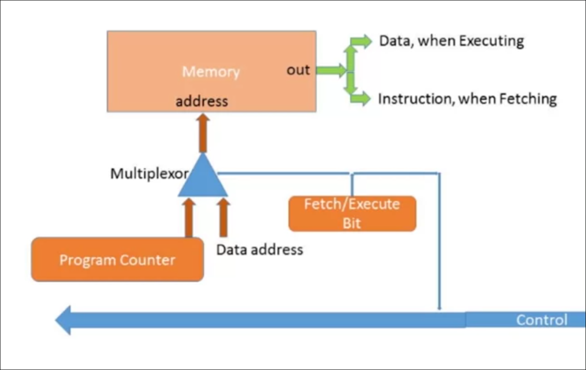
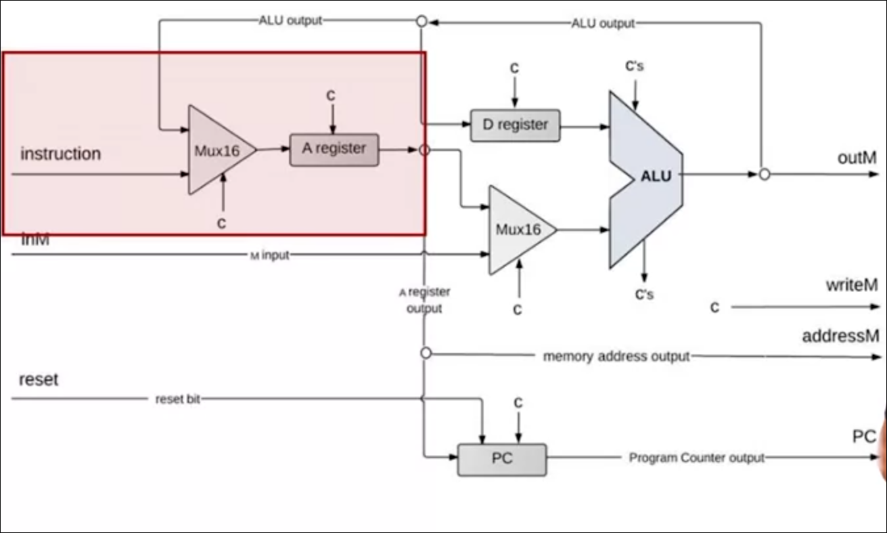

		- [ ] Let's implement a computer
# Von Neumann Architecture
We have covered the concept of Universality, a machine can take instructions and its behavior changes upon these instructions. So we get a machine that can do multiple things.

The first implementation of this idea was done by Jon von Neumann in his architecture

The general architecture is like the following


The memory will hold a sequence of instructions that can be executed one by one. CPU will handle the execution of this program

## Elements
- CPU
	- ALU: a unit that can do arithmetic and logical operations on two numbers
	- Registers
- Memory
	- Program
	- Data


## Information Flow


We have three types of information that flow.
1. Data: What data we need to operate on?
2. Address: What piece of data are we interested in? what address of the next instruction is to be executed next?
3. Control: What the program must do at each part?

These sometimes are address as buses.

## The Arithmetic Logic Unit

We get the data, operate on them either arithmetically or logically and return them back

We need information from the control bus to decide upon the operation to do next. According to the result, it can also tell other part of the system what to do.

## Registers

Intermediate values in the registers. They only take, store data and we can retrieve data from. Sometimes we have registers that work as pointers and hold addresses. That's why they are connected to the address bus.

Registers refer to high-speed storage areas in the CPU. The data processed by the CPU are fetched from the registers

## Memory

They are connected to the address and data buses since data and program operate on them

### Data 
We need access to address so we can specify the register and retrieve and write to it.

### Program
We need to specify the next instruction using the address buses. It also feed the control bus to inform the program what to do.

# The Fetch-Execute Cycle

The basic CPU loop is to fetch an instruction from the program instruction and execute it.

## Fetching
- Put the location of the next instruction into the "address" of the program memory. The address is specified by the Program Counter
- Get the instruction code itself by reading the memory contents at that location.


Given an address, the program memory retrieves the next instruction.

## Executing

The instruction code specifies what to do
- What arithmetic or logical instruction
- What memory to access
- if/where to jump

Different subsets of the bits control different aspects of the operation. Execution also involved accessing registers and/or data memory.

The details about how they exactly translate to inputs to the remaining parts of the system later

## CLASH!

Will we put the instruction address on the address bus or the address of the data memory? We can only have one address


We do one after another. We will use a Multiplexer to plug in the address input of the memory and get the instruction address in the fetch cycle and the data in the executing cycle 



Then, in the fetch cycle the instruction being run will be in some register for later access when we need it in the data cycle


A simple solution implemented in Harvard Architecture, which is a variant of the von Neumann Architecture, is to keep program and data memory in two separate modules.

*This will our overall computer architecture*


# The HACK Central Processing Unit

## Abstraction

Think of it as a black boxes that does two things
- Execute the current instruction (later)
- Figure out which instruction to execute next.

## Interface
First, It works alongside with the instruction memory and the data memory.


Inputs:
- Data value: value of the current register chosen
- instruction: the one fetched in the cycle above
- Reset bit: one bit input

Outputs:
- Data value: data to write
- write to memory( yes/ no)
- Memory address
- Address of next instruction.

## Implementation


`c=control bits`

Let's zoom in on various parts

### Instruction Handling



CPU handling of an A-instruction.
- Decodes the instruction into op-code (first bit) + 15-bit value.
- store the value in the register
- Outputs the value.

CPU handling of an C-instruction
- Decodes the instruction into op-code (first bit) + ALU control bits + Destination load bits + Jump bits

the A register sometimes can be fed from the ALU output. This depends on the op-code. If it's an A-instruction, get the A register value from the instruction. otherwise, from the ALU output

## ALU Operation


ALU Inputs:
- From the D-register
- From the A-Register / M-register

The control bits that determine the second input is one in the instruction, which is the `a` part in the C-instruction

Result of the ALU calculation is fed to D-register, A-register, or M-register

*destinations*


They are determined by the destination bits. Looking back at the `dest` table, we can tell that a change in made to a register when the corresponding bit is `1` in the `dest` part of the instruction. [so these three bits are given as the load input to these three registers and `writeM`]

ALU also results two inputs that say something about the output, whether it's negative or zero. They are results that go around the system as control bits

## Control


The reset input is used to as a way to start the system. Think of it as the button of starting up the hack computer (power on button).

The computer is loaded with some program. When you push *reset*, the program starts running. It's used as the reset input to the *program counter*. 

### Program Counter Abstraction
- Emits the address of the next instruction
	- To start/restart, `PC=0`
		- `next`: no jump: PC++
		- goto: unconditional jump: PC = A
		- conditional goto: if the conditions is true PC=A else PC++
```c
if (reset == 1) PC=0
else 
	// current instruction
	load = f(jump bits, ALU control outputs)
	if (load) PC=A
	else PC++
```

# The Hack Computer
**Abstraction**: A computer capable of running programs written in the Hack Machine Language.

## CPU 
- If the instruciton includes D and A, the respective values are read from and/or written to, the CPU resident D-register and A-register.
- If the instruction is `@x` then `x` is stored in the A-register.
- If the instruction's RHS includes M, the value is read from `inM`
- If the instruction's LHS includes M, then the ALU output is emitted by `outM` and the `writeM` bit is asserted
- if `reset=0`
	- CPU logic uses the instruction's jump bits and the AlU's output to decide if there should be a jump
	- If there's a jump; PC is set to the value of the A-register
	- The updates PC value is emitted by PC
- if `reset=1`
	- `PC` is set to 0, pc emits `0`

## Memory

Abstraction:
1. RAM: Address 0 to 16383: data memory
2. Screen: Address 16384 to 24575: screen memory map
3. KBD: Address 24576: keyboard memory map


### RAM

Implemented by a 16-bit 16K RAM chip. Notice that the output of the RAM to the memory if the address is in domain


### Screen
Implemented by a built-in 8K screen Chip featuring a raster display refresh side-effect. Same as the RAM with this side effect


### KBD

No input, just a output chip that has a side effect.


## ROM32K

It's the instruction memory. A program is somehow loaded into this chip and we press the `reset` button to start this computer running

### Loading a program
1. Hardware implementation: Plug-and-play ROM chips into the Hack computer
2. Hardware simulation: programs are stored in text files; program loading is emulated by the built-in ROM chip.

### ROM interface


It's a read-only program to output instructions. the address is fed from the program counter.

## Implementation


> [!quote]
> “We ascribe beauty to that which is simple; which has no superfluous parts; which exactly answers its end; which stands related to all things; which is the mean of many extremes.”
> -- Ralph Waldo Emerson


# References
- Build a Modern Computer from First Principles - Part 1|Nand2Tetris