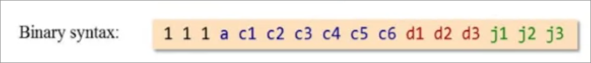
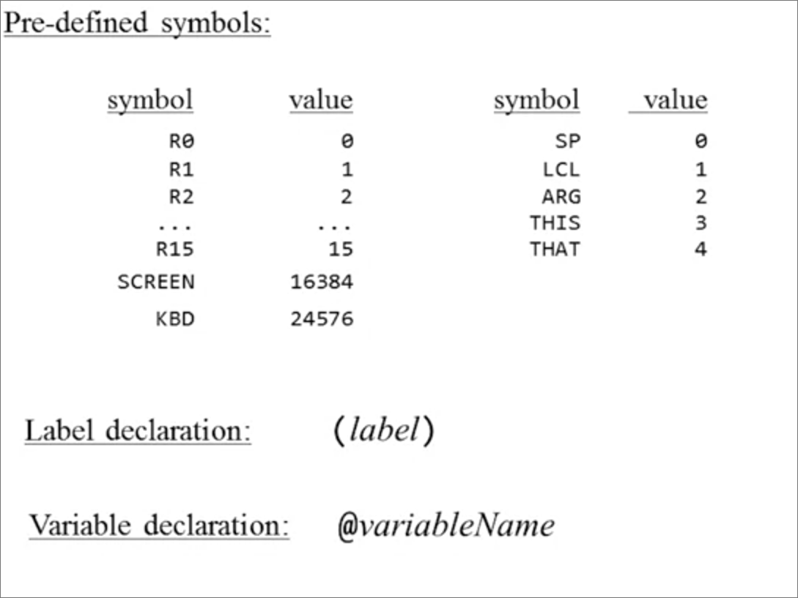
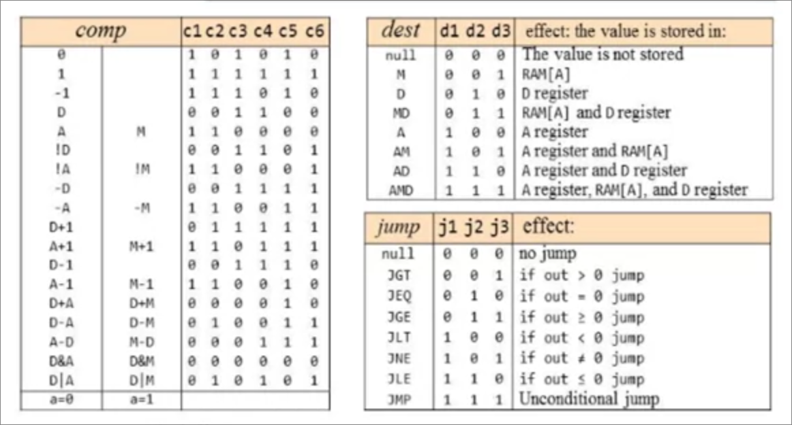
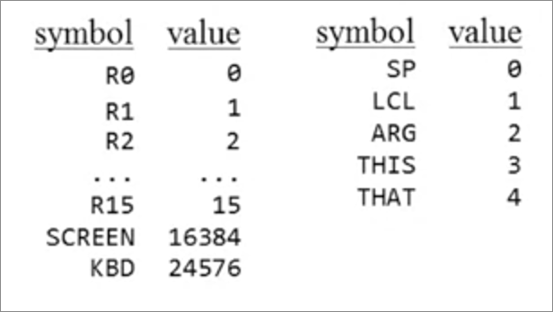
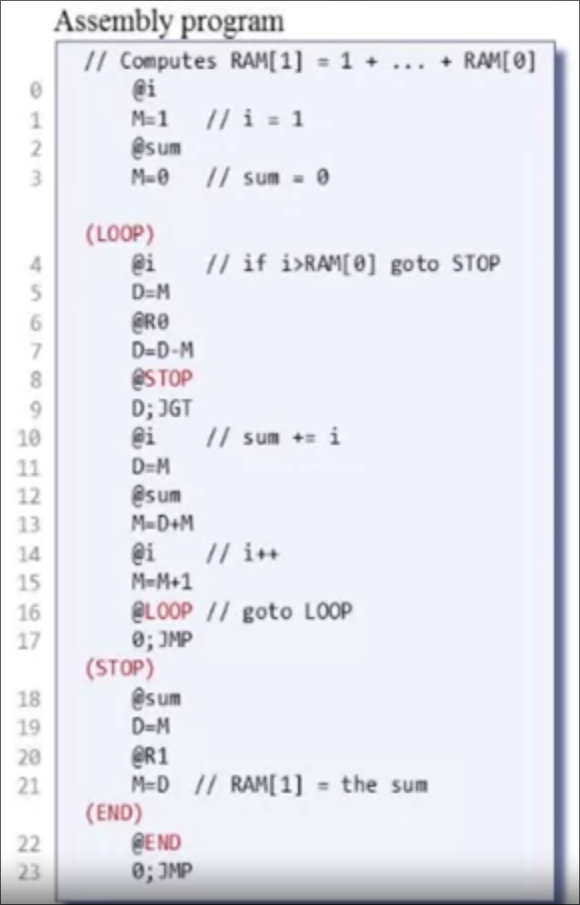

# Assembly Language and Assembler

There has been a gap between our symbolic code and the machine language that the CPU understands. This gap is filled with a *software* called the *Assembler*

> [!info]
> How we can build an assembler 
> 1. We can write code in assembly language and translate it to machine language by hand
> 2. We can make this version 0.1 and use this version to make more features of the assembler, using version 0.1 to build version 0.2, and version 0.2 for version 0.3. and therefore till we have the 1.0 version

The assembler is the first software layer which all the abstraction of the computer hierarchy is based on.

In this course, we will build the second computer and not the first, meaning that we will use another computer that can run high-level language to build our second-computer assembler. [boring 😒]

## Basic Assembler Logic

1. Repeat
	1. Read the next Assembly language command
		Each line is read into an array of characters, ignore unimportant white-spaces and also comments
		For example we would break the next segment of code like this
		```asm
		// Process the code
		load R1, 18
		```
		into the next character array 
		[L,o,a,d, ,R,1,,,1,8]
	2. Break it into the different fields it is composed of
		The fields are `load`, `R1`, `18`
	3. Lookup the binary code for each field
		Each assembly language has some table that maps each command/field/number to its opcode.
	4. Combine These codes into a single machine language command
		Group the fields opcodes and create a machine language instruction
	5. Output this machine language command
2. Until end-of-file reached

## Handling Symbols
Symbols are used for 
- Labels: 
	- The parts we address when we need to jump to some point in the program
- Variables

The assembler needs to replace each variable and label with addresses, doing that through some table. 

### Handling variables
- If the variable is in the table, we just return the value it refers to, using or mutating it.
- If the variable isn't in the table, we allocate memory and dedicate it for the new variable.

### Handling Labels
- The value of each label is the instruction line number. When we use the jump statement, the label value is looked up in the table and we jump to there.
- *Forward references*: When we jump to a label that has been defined in the table yet. Possible solutions are
	1. Leave blank until label appears, then fix
	2. In first pass, just figure out all addresses

# The Hack Assembly Language

To build an assembler, we have to know the grammar (syntax rules) of both languages.

## Hack Language specification
### A-Instruction
Symbolic syntax
```asm
@value
```
Where value is either
1. a non-negative decimal constant
2. A symbol referring to such a constant

Binary Syntax
```
0valueInBinary
```

### C-Instruction
Symbolic Syntax
```asm
dest=comp; jump
```



### Symbols



## Assembly Program Elements
- white space
	- empty lines / indentation
	- Line comments
	- In-line comments
- Instruction
	- A-instruction
	- B-instruction
- Symbols
	- References
	- Label declaration

*We will deal with symbols later, using some features we will build to add them to the assembler, so we have to handle white space and instructions* 

### Handling White space
Ignore It!

# Handling Instructions

## A-instructions
- If the value is a decimal constant, generate the equivalent 15-bit binary constant.
- If value is a symbol, later since we are writing a symbol-less code program

## C-Instructions
First remember the meanings behind each statement and the equivalent machine code



We know that a C-instruction is composed of three parts. We will use a *parser* to separate these three fields and handle each in isolation.

So we create the binary instruction like following
1. Add the opcode `111`
2. Handle the `comp` part, by looking up the table above
3. Handle the the `dest` part by looking up the table above. Set `null` if not there
4. Handle the the `jump` part by looking up the table above. Set `null` if not there

## The overall logic of symbol-less machine language assembler

For each instruction
- Parse the instruction: break it into its underlying fields
- A-instruction: translate decimal value into a binary value
- C-instruction: for each field in the instruction, generate the corresponding binary code and assemble the translated binary codes into a complete 16-bit machine instruction
- Write this 16-bit instruction to the output file

# Handling Symbols
The more symbols we have, the more expressive our program is. Symbols are an important feature of any assembler.

We have three kind of symbols
- variable symbols
	- represent memory locations where the programmer wants to maintain values
- label symbols
	- Represent destinations of `goto` instructions that we use for mimicking the behavior of `if` and `loop` statements. Also used to end the program
- predefined symbols
	- represent special memory locations

## Predefined symbols
We have 23 symbols



We have these symbols that are only used in A-instruction. We just replace `@preDefinedSymbol`  with its value that is stored in the table

## Labels symbols

Declared by the pseudo-command (XXX) [called pseudo commands since they aren't directly translated to instructions]

This directive defines the symbol `XXX` to refer to the memory location holding the next instruction in the program. We have to generate all the line numbers first and then map each label to the line after it [since it itself isn't counted when generating line numbers]

Example


Notice that there are no corresponding line number for (XXX) pseudo instructions 

To translate `@labelSymbol`, replace `labelSymbol` with its value.

## Variable Symbols
Any symbol that is not predefined and not declared elsewhere using the (XXX) directive is treated as a variable

Each variable is assigned a unique memory address, starting at 16, since the first 16 memory locations are taken by `R0-R15`. [memory locations start at 0]

To translate `@variableSymbol`,
- If you see it for the first time, assign a unique memory address
- Replace `variableSybmol` with its value

## Symbol table

*Initialization*: A table that maps each symbol to its value. It's initialized with all the 23 predefined symbols.

*First Pass*: Next we go through the entire file, looking up label declarations and counting the lines ignored white-spaces and labels, and adding the labels values to the table

*Second Pass*: Add the variable symbols

## The Assembly process

*Initialization*:
1. construct an empty symbol table
2. Add the pre-defined symbols to the symbol table

*First Pass*
1. Scan the program
2. For each instruction of the form (XXX)
	1. Add the pair (XXX, address) to the symbol table, where `address` is the number of the instruction following this pseudo command

*Second Pass*
1. Set n to 16
2. Scan the entire program again; for each instruction
	1. If the instruction is `@symbol`, look up `symbol` in the symbol table
		1. If the instruction is found, use `value` to complete the instructions translation
		2. If not found
			1. Add (symbol, n) to the symbol table
			2. Use n to complete the instructions's translation
			3. n++
	2. if the instruction is a C-instruction, complete the instruction's translation
	3. Write the translated instruction to the output file
	

# Proposed Software Architecture for developing a Hack Assembler

## Reading and parsing commands
Note that in this sub-task, we don't need to understand what the commands so.

- Start reading a file with a given name
	- Constructor for a Parser object that accepts a string specifying a file name
- Move to the next command in the file
	- `hasMoreCommands()`
	- `advance()`
	- remember to skip white-space including comments
- Get the field of the current command
	- Type of current command (A-command, C-command, or Label declaration)

## Translating Mnemonic To code
No need to worry about how the mnemonic field were obtained. Implementation details have been written above

## Symbol Table
No need to worry about these symbols mean. Implementation details have been written above

