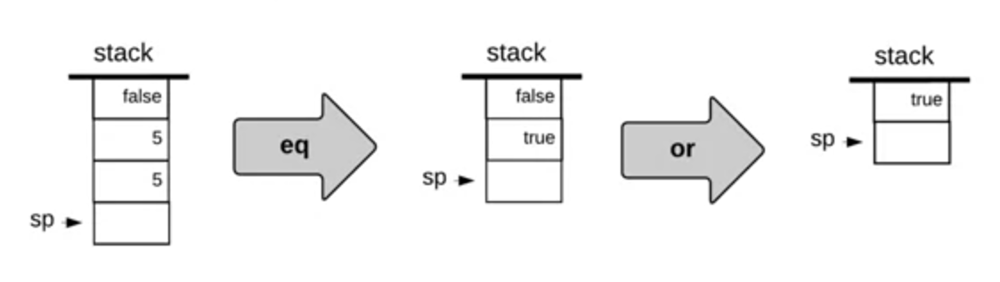

# Program Compilation
---


We would want our high-level program to run on many devices, but every device has his own processor and therefore his own compiler.


An alternative is to "write once, run anywhere". The solution is to no compile down to the machine language. We compile down to VM code (In java, it's called bytecode). Then each device must have his own implementation that takes the VM code to machine language


We now can separate the process of compilation and VM translation. 

We will create a programming language called Jack. This must run on our PC and the Hack computer. We write a compiler that translates code to VM code. In our pc, it will run on the VM emulator, and on the Hack computer, it will run on the VM translator


This Virtualization idea is the cornerstone of cloud computing and networking, and is here used in the Virtual Machine. This is the idea of [[Alan Turing]], which is how a universal machine or a universal Turing machine can execute the commands of anther machine. 

> [!quote]
> We can only see a short distance ahead, but we can see plenty there that needs to be done.
> -- Alan Turing


# VM Abstraction: the Stack

What do we want our VM code to be like? We want to shorten the gap between high-level program and the machine language to ease the translation process.

We can use the Stack machine abstraction to create this VM code.

## Stack


We have `sp` as a pointer to the place the new plate would be pushed.


We also have some arithmetic operations as well
1. `add`: pop the top 2 values and add them and push the result
	
2. `neg`: pop the top value, negate it, and push the result
	

We can notice that every function can be implemented by popping the data, computing the result and pushing the result. Here are other examples




## The stack machine model

It's manipulated by
- Arithmetic / Logical commands
- Memory Segment commands
- Branching commands
- function commands

### Arithmetic / Logical commands


Any arithmetic or logical expression can be expressed and evaluated by applying some sequence of the above operations on a stack

# VM Abstraction: Memory Segments

We know that are different kinds of variables
1. static variables
2. local variables
3. argument variables


We want to preserve the difference between these kinds of variables. We will have different segments of memory each dedicated to each kind. 


Now we have to specify where to push and pop


But all the variable names have been lost, and they don't recognize them.

We will add a fourth segment for constants, just for consistency and making compilation easier. 


We also have other four segment, because there is much to handle in high level language


But we handle all of them the same way

- push: `push segment i`: where segment is one of the 8 segments above and i is a non-negative integer.
- pop: `pop segment i`: where segment is one of the 8 segments above except for the constants segments and i is a non-negative integer.

# Implementing the stack

We need to map the starting point of each memory segment to portions of the RAM.

We need to know Pointer manipulation

## Pointer Manipulation
Notation: 
- `*p`: returns the value at memory location p points at (indirect addressing)
	In hack
	```asm
	@p
	A=M
	D=M
	```
- `p--`: increment the value of p, that is the memory location. Notice that we are treating `p` as a normal variable, but the effect is to point to the next memory location
- `*p = 5`: place 5 at the memory location stored in `p`


## Stack Machine
We first put SP in `RAM[0]` and stack base at `addr = 256`


Let's write the assembly commands
pseudo Logic for `push constant 17`

```
*SP = 17
SP++
```

At hack
```asm
@17 // D=17
D=A

@SP // *SP=D
A=M
M=D

@SP // SP++
M=M+1
```

## VM translator perspective
It's a program that translates VM code into machine language. Each VM command generates several assembly commands

# Implementation of memory segments

## Implementing `local`

It starts at 1015 which is stored in `LCL`. In principle, it can be everywhere. 

A command like `pop local 2` will be translated to 

```
addr=LCL+2, SP--, *addr = *SP
```

```asm
// SP--
@SP
M=M-1

// addr = LCL+2
@2
D=A

@LCL
D=D+A

@addr
M=D

// *SP
@SP
D=M

// *addr = *SP
@addr
M=D
```


Notice that we didn't remove the 5 from the stack, but we decreased the value of SP, which will simply overwrite that 5 when we need that


## Implementing `local`, `argument`, `this`, `that`

When translating the high-level code of some method into VM code, the compiler
- maps the method's local and argument variables onto the local and argument segments
- maps the object fields and the array entries that the method is currently processing onto the `this` and `that` segments

Each segment has its own pointer to the base address of each segment, and therefore the implementation of `local` extends to the remaining 3 segments


## Implementing `constant`

This segment is virtual, it doesn't really exist
- `push constant i`: the implementation is just to supply the specified constant `*SP=i, SP++`

## Implementing `static`

They should be seen by all the methods in a program and the solution is to store them in some global space.
We will have the VM translator translate each VM reference `static i` (in file `Foo.vm`) into an assembly reference `Foo.i`

```asm
// file name : Foo.vm
// pop static 5
// D=stack.pop (code omitted)
@Foo.5
M=D

// push static 5
```

So the entries of the static segment will end up being mapped onto `RAM[16]`, `RAM[17]`, ..., `RAM[255]` in the order in which they will appear in the program

## Implementing `temp`
Sometimes the compiler needs some temp variables. We have 8 such temporary variables. They are mapped on RAM locations 5 to 12.


## Implementing `pointer`

It generates code that keeps track of the base addresses of the `this` and `that` segments using the `pointer` segment

We can only push and pop 0 and 1 and each other integer is invalid. accessing `pointer 0` means accessing `this` and `pointer 1` means `that`

Implementation: supplies THIS or THAT.


# VM Implementation on the Hack Platform

When you do translate each command, write also a comment above


Our mapping has to be standard


